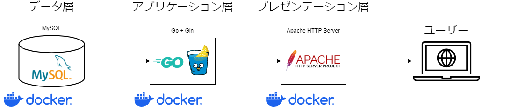
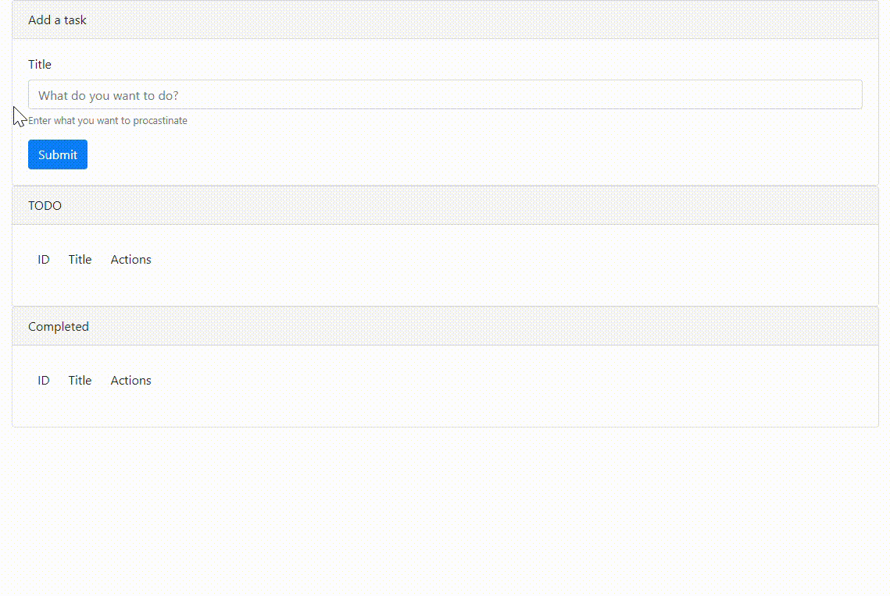

# Simple TODO App for Web Development Tutorial

## Architecture


## Demo


## How to Start
### Create `.env` File
```
cd docker
cp .env_example .env
# Modify .env file as you like (especially passwords).
```

### Start Container
```
docker compose up -d
```

Note: If the application container does not start successfully, wait until the database container is fully started.
Then restart the application container.

### Access With Your Browser
http://localhost

## Reference
- [GoでToDOリストを作ろう！](https://trap.jp/post/1515/)
- [go-todo](https://github.com/ichtrojan/go-todo/)
